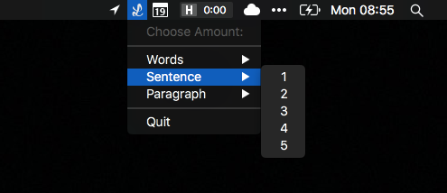

# LoremFiller

[](https://greenkeeper.io/)

[](https://github.com/kreativgebiet/loremipsum-app/releases/download/v1.0.0/LoremFiller-1.0.0.zip)
Simple menubar application for generating dummy text

## [Download](https://github.com/kreativgebiet/loremipsum-app/releases/download/v1.0.0/LoremFiller-1.0.0.zip)

To download [click here](https://github.com/kreativgebiet/loremipsum-app/releases/download/v1.0.0/LoremFiller-1.0.0.zip)

## Screenshot



## Development

To contribute to the application clone the project create a new branch and work in that branch. Afterwards create a [new pull request](https://github.com/kreativgebiet/loremipsum-app/compare/). Be sure to `npm install` before beginning to work.

### Run

To make it easier for different developers, we used `npm scripts` to create on simple command for a more complex one like this:

```
npm start
```

### Build package

To build the project run the following command:

```
npm run build
```


## License

Licensed under [MIT license](LICENSE)
